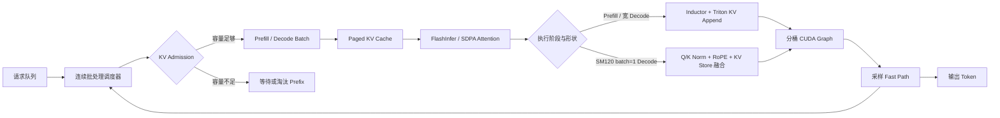

# nano-vLLM｜面向 Blackwell SM120 的离线 LLM 推理引擎优化

基于 [GeeeekExplorer/nano-vLLM](https://github.com/GeeeekExplorer/nano-vllm)
实现的单卡离线推理引擎实践。项目面向 RTX 5060 Laptop（Blackwell
SM120），围绕 Attention、Paged KV Cache、连续批处理、CUDA Graph 和
CUDA 算子融合完成端到端适配与优化。

项目重点不是堆叠功能，而是建立一条可审计的性能工程链路：
**兼容基线 → Profiler 定位 → 分层优化 → 消融实验 → 独立进程 A/B →
按负载保守调度**。

> 项目定位：用于学习和验证 LLM 推理系统核心机制，不等价于生产级
> vLLM。文中的 7.66× 是相对本项目复现的上游 SM120 SDPA 兼容基线，
> 不是相对官方 `vllm-project/vllm` 的性能结论。

## 核心成果

| 方向 | 主要实现 | 已验证结果 |
|---|---|---|
| SM120 适配 | SDPA 兼容基线、FlashInfer Paged Attention | Qwen3-0.6B 可在 SM120 离线运行 |
| 执行路径 | 无 Host 同步 KV Append、分桶 CUDA Graph、采样 Fast Path | 固定矩阵相对兼容基线几何平均加速 8.23× |
| KV Cache 与调度 | 16-token Page、Prefix Cache、Mixed Continuous Batching、输出感知 KV Admission | 256 请求长负载无抢占、无重复 Prefill |
| RMSNorm | 接入独立 SM120 fused residual-add RMSNorm | 6 组 E2E 输出吞吐变化 +0.04%～+3.75% |
| Q/K 热路径融合 | Q/K RMSNorm + RoPE + Paged KV Store 单 kernel | batch=1 Decode +1.77% / +2.31% |

## 端到端结果

长负载条件：Qwen3-0.6B FP16、RTX 5060 Laptop SM120、256 个请求、输入和
输出长度随机分布于 100–1024、`seed=0`、三轮独立进程。

| 版本 | 中位吞吐 | 中位运行时间 | 峰值 Allocated 显存 |
|---|---:|---:|---:|
| 上游 SM120 SDPA 兼容基线 | 247.66 tok/s | 540.92 s | 5.96 GiB |
| 优化版 M8 Offline | **1,898.00 tok/s** | **70.58 s** | 6.56 GiB |

- 吞吐提升 **7.66×**，运行时间降低 **86.95%**。
- 实际 Prefill Token 为 **142,827**，与输入 Token 完全一致。
- 调度器抢占次数和重复 Prefill Token 均为 **0**。
- 显存增加约 **10.1%**，主要来自 CUDA Graph、FlashInfer Workspace 和
  Decode KV 预留。

完整阶段数据见
[`ROADMAP_RESULTS.md`](docs/optimizations/ROADMAP_RESULTS.md) 和
[`m8_upstream_comparison_summary.json`](benchmarks/results/m8_upstream_comparison_summary.json)。

## 系统设计



### 1. Attention 与 KV Cache

- 使用 FlashInfer Paged Attention，避免逐请求重建连续 KV。
- 使用 Triton 根据 `slot_mapping` 写入 Paged KV，热路径不执行
  `nonzero`、`.item()` 或 Host 同步。
- KV Page 从上游大页调整为 16 tokens，在 8 GiB 显存上减少内部碎片。
- Prefix Cache 支持 LRU/FIFO 淘汰，并记录命中、冲突、逐出和节省的
  Prefill Token。

### 2. Decode 执行路径

- 按 batch size 分桶捕获 CUDA Graph，降低 Python 调度和 Kernel Launch
  开销。
- FlashInfer Decode Wrapper、Workspace 和 Metadata 跨层复用。
- Greedy、全随机和混合采样分别走 Fast Path，避免统一路径的冗余计算。

### 3. 调度与显存压力控制

- 支持 Prefill/Decode 混合连续批处理，新请求不必等待当前 Decode 全部结束。
- Admission 同时考虑当前 KV 占用和请求最大输出长度。
- 已知输出上限的离线负载使用 KV 预留，避免“先准入、再抢占、重新
  Prefill”的性能雪崩。

### 4. SM120 CUDA 算子融合

独立 CUDA 项目：
[FILWYZ/sm120-norm-fusion-kernels](https://github.com/FILWYZ/sm120-norm-fusion-kernels)。

- fused residual-add RMSNorm 提供与 vLLM/FlashInfer 相同的原地语义。
- Qwen3 Decode 将 Q/K RMSNorm、半分式 RoPE、旋转后 K 写入和 V 写入
  融合为一个 CUDA kernel。
- 使用 FP32 累加、warp shuffle reduction 和每线程四元素寄存器缓存。
- 通过 PyTorch Custom Operator mutation schema 接入
  `torch.compile(fullgraph=True)` 和 CUDA Graph。
- 全局启用曾导致部分 Prefill 回退，因此最终只对
  **SM120 + head_dim=128 + batch=1 Decode** 启用；其他情况回退 Inductor。

Qwen3-0.6B BF16、五个独立进程、A/B 交替顺序的最终结果：

| Prompt | Torch Decode | SM120 Decode | Decode 提升 | 输出吞吐提升 |
|---:|---:|---:|---:|---:|
| 64 tokens | 217.67 tok/s | 221.53 tok/s | **+1.77%** | **+1.24%** |
| 256 tokens | 212.94 tok/s | 217.85 tok/s | **+2.31%** | **+1.72%** |

设计取舍与负优化复盘见
[`M9_SM120_RMSNORM.md`](docs/optimizations/M9_SM120_RMSNORM.md) 和
[`M10_QK_NORM_ROPE_KV.md`](docs/M10_QK_NORM_ROPE_KV.md)。

## 优化路线

| 阶段 | 优化内容 | 解决的问题 |
|---|---|---|
| M0 | SM120 SDPA 兼容基线与固定 Benchmark | 建立可运行、可比较的起点 |
| M1 | FlashInfer Paged Attention | 避免连续 KV 重建 |
| M2 | 无同步 Triton KV Append | 删除 Host 同步与多余索引操作 |
| M3 | 分桶 Decode CUDA Graph | 降低 Dispatch 和 Launch 开销 |
| M4 | 16-token KV Page | 平衡容量利用率和页管理成本 |
| M5 | Mixed Continuous Batching | 降低新请求排队时间 |
| M6 | LRU Prefix Cache | 复用公共 Prompt 的 KV |
| M7 | Sampling Fast Path | 删除确定性采样冗余工作 |
| M8 | 输出感知 KV Admission | 避免抢占和重复 Prefill |
| M9 | fused residual-add RMSNorm | 验证独立算子到真实引擎的收益传递 |
| M10 | Q/K Norm + RoPE + KV Store 融合 | 优化 batch=1 Decode 热路径 |

## 工程验证

- nano-vLLM：`41 passed`，另有 `5 subtests passed`。
- CUDA 算子仓库：`180 passed`。
- Compute Sanitizer：memcheck `0 errors`，racecheck `0 hazards`。
- 自定义算子通过 `torch.compile(fullgraph=True)`、CUDA Graph capture/replay。
- 性能数据采用 CUDA Event 或端到端计时；正式 A/B 使用独立进程、固定
  seed、交替顺序和中位数汇总。
- 原始大型 NCU/Trace 文件不提交，仓库保留汇总 JSON、复现脚本和指标边界。

## 快速复现

```bash
git clone https://github.com/FILWYZ/nano-vllm-sm120-optimized.git
cd nano-vllm-sm120-optimized

uv venv --python 3.12
source .venv/bin/activate
uv pip install -e ".[flashinfer]"
uv pip check
pytest -q
```

如需启用 M9/M10 的 SM120 CUDA 后端：

```bash
git clone https://github.com/FILWYZ/sm120-norm-fusion-kernels.git
cd sm120-norm-fusion-kernels
CUDA_HOME=/usr/local/cuda-12.8 \
TORCH_CUDA_ARCH_LIST=12.0 \
python -m pip install -e . --no-build-isolation
pytest -q
```

运行 Q/K 融合端到端 A/B：

```bash
cd /path/to/nano-vllm-sm120-optimized
python -m benchmarks.run_qk_norm_rope_ab \
  --model /path/to/Qwen3-0.6B \
  --runs 5 \
  --output-dir benchmarks/results/qk_norm_rope_final_dispatch_ab

python -m benchmarks.summarize_qk_norm_rope_ab \
  benchmarks/results/qk_norm_rope_final_dispatch_ab \
  --output benchmarks/results/qk_norm_rope_final_dispatch_ab_summary.json
```

## 代码导航

```text
nanovllm/engine/             Scheduler、Block Manager、Model Runner
nanovllm/layers/attention.py Attention 后端与 Triton KV Append
nanovllm/layers/flashinfer_backend.py
                             FlashInfer Plan/Run 与 CUDA Graph 复用
nanovllm/layers/layernorm.py RMSNorm 后端 dispatch
nanovllm/layers/qk_norm_rope.py
                             Q/K Norm+RoPE+KV 融合接口与 fallback
nanovllm/models/qwen3.py     Qwen3 热路径集成
benchmarks/                  Micro、E2E、A/B 与结果汇总
tests/                       正确性和后端一致性测试
```

## 适用范围与限制

- 主要验证 Qwen3-0.6B、单卡 8 GiB、RTX 5060 Laptop SM120 和离线负载。
- M8 长负载记录使用 FP16；M10 Q/K 融合记录使用当前模型配置的 BF16。
- 尚未实现 HTTP Server、LoRA、量化、Speculative Decoding、多卡并行和
  多租户隔离。
- 输出感知 KV 预留适用于已知 `max_tokens` 的离线负载；未知输出长度或
  强在线公平性场景需要不同 Admission 策略。
- 自定义 CUDA kernel 只在经 A/B 验证的窄形状启用，不能外推到其他 GPU、
  模型或 batch size。

## 致谢与声明

本项目继承 GeeeekExplorer/nano-vLLM 的教学代码和 MIT License，并在独立
分支中完成 SM120 适配、系统优化和实验验证。项目名称用于说明技术方向，
不代表与上游项目或官方 vLLM 存在从属关系。
