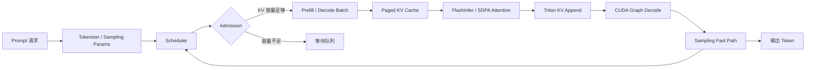

# nano-vLLM｜SM120 离线 LLM 推理引擎适配与性能优化

基于 [GeeeekExplorer/nano-vLLM](https://github.com/GeeeekExplorer/nano-vllm) 的教学型推理引擎实践项目。该分支面向 NVIDIA RTX 5060 Laptop（Blackwell SM120），目标是建立一个**可离线运行、可解释、可复现**的轻量级 LLM 推理系统，并以工程化方式验证每一项优化。

> 项目定位：学习型/研究型推理引擎，不声称等价于生产级 vLLM，也不声称相对官方 `vllm-project/vllm` 全面领先。

## 项目亮点

- **硬件适配**：为 SM120 + PyTorch 2.11.0/cu128 建立可运行的 SDPA 兼容路径，并接入 FlashInfer 优化路径。
- **推理优化**：覆盖 Paged Attention、无同步 KV Append、分桶 CUDA Graph、KV Page、连续批处理、Prefix Cache 和采样 Fast Path。
- **高压调度优化**：针对长序列高显存压力场景，引入输出感知 KV Admission，减少抢占和重复 Prefill。
- **工程验证**：每个里程碑保留 Git Tag、测试门禁、原始 JSON、消融实验和复现命令，支持从基线逐步回滚与定位。

## 技术栈

`Python` · `PyTorch` · `CUDA` · `Triton` · `FlashInfer` · `WSL2` · `uv` · `unittest`

## 项目结构

```text
examples/                  快速上手
nanovllm/                  推理运行时与模型实现
  engine/                  请求生命周期、调度、KV Cache、模型执行
  layers/                  Attention、FlashInfer、采样和基础算子
  models/                  Qwen3 模型
benchmarks/                性能测量与对比
  micro/                   算子级/Kernel 级测量
  e2e/                     端到端、在线批处理和上游 A/B
  analysis/                结果汇总、图验证和形状扫描
scripts/benchmarks/        可重复运行脚本
tests/                     优化正确性门禁
docs/optimizations/        M0–M8 技术路线
```

## 系统流程



核心设计是将“请求调度、KV Cache 生命周期和 GPU 执行路径”作为一个整体优化：短请求使用在线 Mixed Batching；已知最大输出长度的离线长负载使用输出感知 KV 预留和 Prefill-first 配置。

## M0–M8 优化路线

| 阶段 | 主要工作 | 工程问题 |
|---|---|---|
| V0/M0 | SM120 SDPA 兼容基线、固定指标和 Profiler | 先建立可运行、可测量的基线 |
| M1 | FlashInfer Paged Attention | 避免逐请求连续 KV 重建 |
| M2 | Triton 无同步 KV Append | 减少 `nonzero`、标量提取和 Host 同步 |
| M3 | 分桶式 Decode CUDA Graph | 降低 Decode 热路径的 Dispatch 开销 |
| M4 | 16-token KV Page | 在容量利用率与页管理开销之间取平衡 |
| M5 | Mixed Continuous Batching | 降低新 Prompt 到达时的 Decode 等待 |
| M6 | LRU Prefix Cache | 显式观测命中、冲突、逐出和 Prefill 节省 |
| M7 | Sampling Fast Path | 对确定性输出减少不必要的随机采样开销 |
| M8 | 输出感知 KV Admission | 避免高压长负载中的抢占与重复 Prefill |

详细的实现原因、代码入口、正确性门禁和阶段指标见 [`docs/optimizations/ROADMAP_INTERVIEW_GUIDE_CN.md`](docs/optimizations/ROADMAP_INTERVIEW_GUIDE_CN.md)。

## 已验证结果

### GitHub README 长负载 A/B

测试条件：Qwen3-0.6B FP16、RTX 5060 Laptop SM120、256 个请求、随机输入/输出长度 100–1024、`seed=0`、`temperature=0.6`、`ignore_eos=True`、三轮独立运行。

| 版本 | 中位吞吐 | 中位运行时间 | 峰值 Allocated 显存 |
|---|---:|---:|---:|
| 上游 SM120 Compat 基线 | 247.66 tok/s | 540.92 s | 5.96 GiB |
| 优化版 M8 Offline | **1,898.00 tok/s** | **70.58 s** | 6.56 GiB |

- 中位吞吐：**7.66×**（+666.4%）。
- 中位运行时间：降低 **86.95%**。
- M8 调度器抢占：**0 次**；实际 Prefill Token：**142,827**，与输入 Token 完全一致。
- 峰值 Allocated 显存增加约 **10.1%**，主要用于 CUDA Graph、FlashInfer Workspace/Metadata 和 Decode KV 预留。

### 固定形状矩阵

在请求数 `{1, 4, 8}`、输入长度 `{64, 256}`、输出长度 `32` 的 6 组矩阵中，M7 相对 Compat 基线的几何平均中位加速比为 **8.23×**，36 个正式进程均生成预期 Token 数。

这些结果只证明：在本项目明确记录的硬件、模型、软件版本和负载下，优化版优于 GitHub 上游派生的 **SM120 最小可运行兼容基线**。这不是对官方 vLLM，也不是对上游在其他 GPU/FlashAttention 环境的性能结论。

## 复现环境

```bash
git clone https://github.com/FILWYZ/nano-vllm-sm120-optimized.git
cd nano-vllm-baseline

uv venv --python 3.12
source .venv/bin/activate
uv pip install -e ".[flashinfer]"
uv pip check
```

准备本地 Qwen3-0.6B 权重后，先运行正确性测试：

```bash
python -m unittest discover -s tests -v
```

运行统一上游 A/B 入口（根据本地模型路径调整）：

```bash
python -m benchmarks.e2e.upstream_ab \
  --model /path/to/Qwen3-0.6B \
  --variant optimized_m8_offline \
  --suite github \
  --block-size 64 \
  --reserve-output-kv \
  --disable-mixed-batching \
  --output benchmarks/results/m8_ab/optimized_m8_offline_github.json

python -m benchmarks.analysis.summarize_m8
```

完整实验计划和对比版本见 docs/optimizations/M8_COMPARISON_PLAN.md 与 docs/optimizations/M8_UPSTREAM_COMPARISON.md；阶段原始结果和大体积 Trace 不纳入公开仓库，仅保留最终摘要。

## 正确性与工程门禁

- `python -m unittest discover -s tests -v`：23 项 CPU/GPU 测试通过。
- `uv pip check`：63 个已安装依赖兼容。
- 覆盖 SDPA/FlashInfer Attention、Triton KV 写入、CUDA Graph/Eager 对拍、页边界、Prefix Cache、混合调度器和采样路径。
- 长负载三轮均生成 133,966 个输出 Token；每个后端内部三轮输出摘要稳定。

## 已知限制

- 当前主要验证 Qwen3-0.6B FP16、单卡 8 GiB、RTX 5060 Laptop SM120 和离线长负载。
- 尚未实现生产级 HTTP Server、LoRA、量化、Speculative Decoding、分布式 Serving 或多租户隔离。
- 输出感知 KV 预留依赖已知 `max_tokens`，未知或严格在线公平性场景需要单独调度策略。
- 兼容基线使用 SDPA fallback；不能将本项目的 7.66× 直接外推为相对官方 vLLM 的加速。

## 文档索引

- [`ROADMAP_RESULTS.md`](docs/optimizations/ROADMAP_RESULTS.md)：阶段结果总览。
- [`ROADMAP_INTERVIEW_GUIDE_CN.md`](docs/optimizations/ROADMAP_INTERVIEW_GUIDE_CN.md)：按大厂面试追问组织的技术讲解。
- [`M8_UPSTREAM_COMPARISON.md`](docs/optimizations/M8_UPSTREAM_COMPARISON.md)：最终 A/B、消融和失败复盘。
- [`RESUME_M8_CN.md`](docs/optimizations/RESUME_M8_CN.md)：基于已验证事实的简历口径。

## 致谢与范围声明

本项目继承 [GeeeekExplorer/nano-vLLM](https://github.com/GeeeekExplorer/nano-vllm) 的教学代码和 MIT License，并在独立分支中进行本地硬件适配、性能实验和文档化改进。项目名称用于说明优化方向，不代表与上游项目或官方 vLLM 的从属关系。
